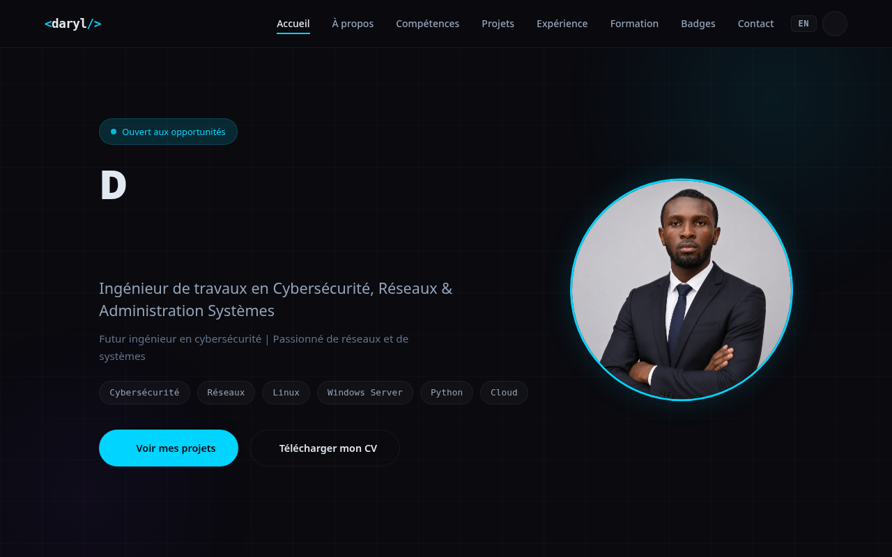

# 🛡️ Portfolio — Divane Daryl Ndjaga Djeugang

Portfolio personnel de **Divane Daryl Ndjaga Djeugang**, ingénieur de travaux en **Cybersécurité, Réseaux & Administration Systèmes**.



---

## 🧰 Compétences

### 🔐 Cybersécurité


### 🌐 Réseaux


### 🖥️ Administration Systèmes


### 💻 Développement


### 🗄️ Données & Blockchain


---

## 📁 Structure du projet

```
portfolio/
├── public/
│   └── assets/
│       ├── documents/    # CV, badges (PDF) et aperçus (PNG)
│       └── images/       # photos
├── src/
│   ├── components/       # Composants React (.jsx) + styles (.css)
│   ├── context/          # Contexte langue / thème
│   ├── data/             # Données statiques (coordonnées)
│   ├── hooks/            # Hooks personnalisés
│   ├── locales/          # Traductions fr.json / en.json
│   ├── App.jsx
│   └── main.jsx
├── index.html
└── vite.config.js
```

## 🚀 Démarrage

```bash
npm install        # installe les dépendances
npm run dev        # serveur de développement
npm run build      # build de production dans dist/
npm run preview    # prévisualisation du build
```

## ✨ Fonctionnalités

- ⚡ **React 18** + **Vite 6**
- 🌍 **Bilingue** Français / Anglais (système de locales)
- 🌙 **Mode clair / sombre**
- 🎨 **Font Awesome** pour les icônes
- 📄 **Aperçu des badges** de certification en image (fiable sur mobile)
- 📧 **Formulaire de contact** via `mailto:` (aucun backend requis)

## 📬 Formulaire de contact

Le bouton **Envoyer** ouvre le client email de l'utilisateur avec les champs préremplis
vers l'adresse configurée dans `src/data/content.jsx` :

```js
export const personalInfo = {
  name: 'Divane Daryl Ndjaga Djeugang',
  email: 'daryldjeugang@gmail.com',
  // ...
}
```

## 🌍 Déploiement

Site déployé sur GitHub Pages :
**[https://daryldjeugang-dot.github.io/Portfolio_Divane/](https://daryldjeugang-dot.github.io/Portfolio_Divane/)**

---

© 2026 Divane Daryl Ndjaga Djeugang — Cybersécurité, Réseaux & Administration Systèmes
